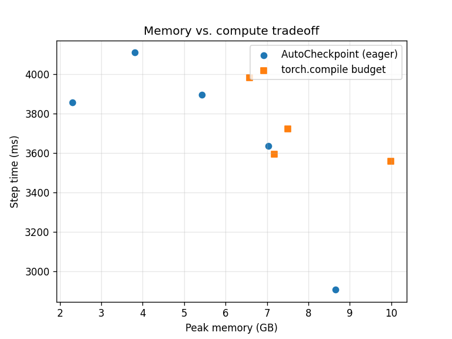

# AutoCheckpoint

A tool that decides which layers of a PyTorch model to gradient-checkpoint so training uses less GPU memory.

Gradient checkpointing saves memory by dropping activations on the forward pass and recomputing them during the backward pass. PyTorch's `torch.utils.checkpoint` already handles the recompute. The part it leaves to you is picking *which* layers to checkpoint, and that choice matters: checkpoint too few and you still run out of memory, checkpoint too many and you waste time recomputing things you had room to keep. AutoCheckpoint profiles the model, measures how much memory each layer holds and roughly what it costs to recompute, and picks the set of layers that meets your memory target for the least extra compute.

On a 12-layer transformer on a T4, it took peak memory from 8.6 GB down to 2.3 GB (about 73%) for roughly a third more time per step. On the same run that was also less memory than PyTorch's own `torch.compile` memory-budget option used.

## How it picks the layers

Checkpointing a layer frees its activation memory `m` but costs one extra forward pass `t`. If you need to free at least `R` bytes to hit your budget, you want the cheapest set of layers whose freed memory adds up to `R`:

```
minimize   sum(t) over the checkpointed layers
subject to sum(m) >= R
```

This is a 0/1 knapsack. Sorting by memory-per-time and greedily taking the best ones is only correct if you can checkpoint fractions of a layer, which you can't, so I solve the real 0/1 version with a dynamic program over memory quantized into buckets:

```
dp[i][k] = least recompute time using the first i layers to free at least k buckets
dp[i][k] = min( dp[i-1][k],                     leave layer i alone
                dp[i-1][max(0, k - m_i)] + t_i )  checkpoint layer i
```

It runs in `O(n * cap)`, where `cap` is how many buckets are in `R`, and backtracking through the table gives the exact list of layers to checkpoint.

Interestingly, PyTorch's `activation_memory_budget` partitioner (the one you get under `torch.compile`) solves this same knapsack. It does it at the level of individual operators on a traced graph; AutoCheckpoint does it at the level of whole modules in eager mode. That makes it handy when you aren't compiling the model, and it keeps the decision easy to read off and inspect.

## Results

12-layer GPT-style transformer, dim 1024, 16 heads, vocab 8192, batch 8, sequence length 1024, one SGD step. Peak memory from `torch.cuda.max_memory_allocated` on an NVIDIA T4.

| Strategy | Peak memory | vs baseline | Step time |
|---|---|---|---|
| no checkpointing | 8.65 GB | — | 2905 ms |
| AutoCheckpoint, keep 75% (3 layers) | 7.04 GB | -19% | 3635 ms |
| AutoCheckpoint, keep 50% (6 layers) | 5.43 GB | -37% | 3896 ms |
| AutoCheckpoint, keep 25% (9 layers) | 3.81 GB | -56% | 4111 ms |
| AutoCheckpoint, all layers | 2.30 GB | -73% | 3859 ms |
| torch.compile, default | 9.99 GB | +16% | 3560 ms |
| torch.compile, budget 0.7 | 7.18 GB | -17% | 3596 ms |
| torch.compile, budget 0.5 | 7.51 GB | -13% | 3723 ms |
| torch.compile, budget 0.3 | 6.58 GB | -24% | 3983 ms |



A couple of things stood out. The best `torch.compile` budget setting got to 6.58 GB; AutoCheckpoint got to 2.30 GB. And `torch.compile` on its default settings used *more* memory than doing nothing (9.99 GB against 8.65 GB), with its budget knob not even moving monotonically. That lines up with a known limitation of its cost model, which can't properly price fused attention.

One caveat worth being upfront about: this is a memory comparison, not a speed one. The T4 is a weak GPU and prints a warning that it can't use `torch.compile`'s faster matmul path, so the timing numbers are noisy and I wouldn't read much into them. Saving memory is the point of checkpointing anyway.

To reproduce:

```bash
python benchmarks/benchmark_checkpointing.py --depth 12 --dim 1024 --batch 8 --seq 1024
```

## Install

```bash
git clone https://github.com/archakamk/autocheckpoint.git
cd autocheckpoint
pip install torch
```

## Usage

```python
import torch
from core.profiler import MemoryProfiler
from core.optimizer import CheckpointOptimizer
from core.apply import apply_checkpointing

model = MyModel().cuda()
sample = torch.randint(0, vocab, (batch, seq)).cuda()  # whatever your model takes

# measure per-layer activation memory
stats = MemoryProfiler(model).profile(sample)

# choose a policy that frees about half the activation memory
total = sum(s.activation_size for s in stats.values())
policy = CheckpointOptimizer(stats, mem_budget=int(0.5 * total)).find_policy()

# wrap the chosen layers; they'll be recomputed on the backward pass
apply_checkpointing(model, policy)

# train as normal
```

If you have real per-layer recompute times, pass them as `recompute_costs={layer_name: milliseconds}`. Without them the optimizer falls back to using activation size as a stand-in for cost, which is fine as a first pass but not as accurate.

## What's in the repo

- `core/profiler.py` puts forward hooks on the leaf modules and records how many bytes each keeps for the backward pass.
- `core/optimizer.py` is the knapsack DP above.
- `core/apply.py` wraps the selected modules in non-reentrant `torch.utils.checkpoint`.
- `benchmarks/benchmark_checkpointing.py` runs the comparison in the results table.

## Limitations

The knapsack treats each layer as independent, which is true enough for models that are basically a straight stack of layers. On models with heavy branching or residual structure it's more of a good heuristic than a guaranteed optimum. Solving it exactly on an arbitrary compute graph turns into an integer program, which is what the Checkmate paper does; I went with the DP because it's fast and easy to follow.

## Still to do

- Fold `core/` into the `autocheckpoint/` package and add a `pyproject.toml`
- Tests for the optimizer and a CI workflow
- Measure real per-layer recompute time in the profiler instead of the size proxy
- Rerun the benchmark on a bigger GPU (A100 or MI300)

## References

- Chen et al., Training Deep Nets with Sublinear Memory Cost (2016)
- Gruslys et al., Memory-Efficient Backpropagation Through Time (2016)
- Jain et al., Checkmate: Breaking the Memory Wall with Optimal Tensor Rematerialization (2020)

## Author

Kalyan Archakam — github.com/archakamk